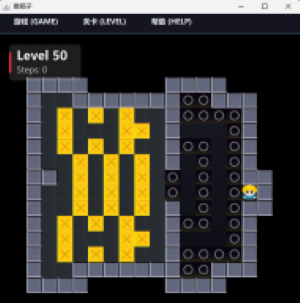

-----

# Sokoban (推箱子小游戏)

> 一个基于 Java Swing 开发的经典推箱子游戏，融合了现代化的霓虹UI风格。

## 项目简介

本项目是对经典益智游戏“推箱子”的重构与现代化适配。在保留核心玩法的基础上，通过自定义 Swing 组件重绘了界面，引入了流畅的动画效果、HTML/CSS 样式的弹窗系统以及完整的存档机制。

项目采用标准的 **MVC** 架构设计，结构清晰，适合 Java 初学者学习 GUI 编程、事件处理及游戏逻辑封装。



## 核心功能

* **经典玩法**：包含推箱子核心逻辑，支持地图碰撞检测、胜利判定。
* **现代化 UI**：
    * **霓虹风格**：深色背景搭配高亮霓虹配色（青色/粉色）。
    * **自定义组件**：重写 `JMenuBar` 和 `JMenuItem`，实现鼠标悬停光效与动画过渡。
    * **HTML 渲染**：利用 Swing 对 HTML 的支持，在 `JOptionPane` 中实现了富文本样式的弹窗（Toast、Confirm Dialog）。
* **游戏系统**：
    * **关卡系统**：支持多关卡加载（1-50关），支持选关跳转。
    * **撤销机制**：支持“时间回溯”（撤销一步），每关限制使用 3 次。
    * **进度保存**：基于序列化的自动存档系统，支持退出后继续游戏。
    * **步数统计**：实时显示当前步数。

## 操作说明

| 按键 | 功能 | 备注 |
| :--- | :--- | :--- |
| **W / ↑** | 向上移动 | |
| **S / ↓** | 向下移动 | |
| **A / ←** | 向左移动 | |
| **D / →** | 向右移动 | |
| **R** | 重玩本关 | 步数清零 |
| **U** | 撤销上一步 | 每关限 3 次 |

## 技术架构与核心实现

本项目严格遵循 MVC 设计模式，并在 Swing 的基础上进行了深度的 UI 定制。

### 1\. 架构概览 (MVC Pattern)

* **Model (模型层)**:
    * `per.GameCode.Sokoban.model`: 定义了游戏的核心数据结构。
    * `GameMap`: 二维数组存储地图数据。
    * `GameLevel`: 处理业务逻辑（移动判定、箱子推动、胜负检查）。
    * `Boy` / `Box`: 继承自 `GameCell`，通过多态管理不同实体的行为和渲染资源。
* **View (视图层)**:
    * `per.GameCode.Sokoban.view`: 负责界面渲染。
    * `GameCanvas`: 核心画布，重写 `paintComponent` 方法，使用 `Graphics2D` 进行双缓冲绘图，支持抗锯齿和渐变背景。
    * `NeonDialogUI`: 封装了基于 HTML/CSS 的 Swing 弹窗工具类。
* **Controller (控制层)**:
    * `Game`: 全局控制器，协调 `GameWindow` 和 `GameLevel`，管理全局状态（如当前关卡、窗口大小调整）。
    * `GameWindow`: 监听键盘事件 (`KeyListener`) 并分发给模型层处理。

### 2\. 核心算法与机制

#### 📌 撤销系统 (Undo Stack)

* **实现原理**：使用了 `LinkedList<GameMove>` 作为栈结构。
* **数据记录**：每次有效移动前，将当前的主角状态（坐标、朝向）和受影响的箱子状态封装为 `GameMove` 对象压入栈中。
* **限制逻辑**：在 `Game.java` 中维护 `undoUsedCount`，并在回退前校验是否达到上限（3次），通过 `NeonDialogUI` 给予视觉反馈。

#### 📌 序列化存档 (Serialization)

* **实现类**：`util.GameSave`
* **机制**：利用 Java 原生的 `ObjectOutputStream` 将游戏状态对象写入本地 `sokoban_save.dat` 文件。
* **保存内容**：包括当前关卡号、主角详细坐标/朝向、所有箱子的位置状态以及移动历史栈，确保读档时能完美复原现场。

#### 📌 霓虹 UI 渲染 (Custom Rendering)

* **CSS in Swing**：在 `NeonDialogUI.java` 中，通过构建 HTML 字符串并内嵌 CSS 样式（如 `text-shadow`、`border-radius`），让原生 Swing 组件呈现出 Web 级的视觉效果。
* **动态菜单**：`GameMenuBar` 使用 `javax.swing.Timer` (60FPS) 实现菜单项 hover 时的透明度渐变动画。

## 📂 项目结构

```text
src/Sokoban/
├── Application.java       // 程序入口 (Main)
├── model/                 // 数据模型与逻辑
│   ├── Game.java          // 游戏总控制器
│   ├── GameLevel.java     // 关卡逻辑
│   ├── GameMove.java      // 移动记录 (用于撤销)
│   ├── Direction.java     // 方向接口
│   ├── map/               // 地图相关
│   │   ├── GameMap.java
│   │   └── ...
│   └── spirit/            // 实体 (人、箱子)
│       ├── Boy.java
│       └── Box.java
├── view/                  // 视图界面
│   ├── MainMenu.java      // 主菜单
│   ├── GameWindow.java    // 游戏主窗口
│   ├── GameCanvas.java    // 绘图画布
│   ├── GameMenuBar.java   // 自定义菜单栏
│   └── NeonDialogUI.java  // 霓虹风格弹窗工具
└── util/                  // 工具类
    ├── GameSave.java      // 存档管理
    └── R.java             // 资源加载器
```

## 快速开始

### 环境要求

* **JDK**: 1.8 或更高版本
* **IDE**: IntelliJ IDEA / Eclipse / VS Code

### 运行步骤

1.  克隆或下载本项目代码。
2.  由于本项目是Maven项目，运行时需确保`resources`下的`images`目录中包含必要的图片资源。
3.  确保`resources`下 `asset/maps/` 目录中包含地图文件（如 `1.map`）。
4.  运行主类 `Application.java` 中的 `main` 方法启动游戏。

-----

**Author**: jaychen675
**Copyright**: © 2025 SOKOBAN
